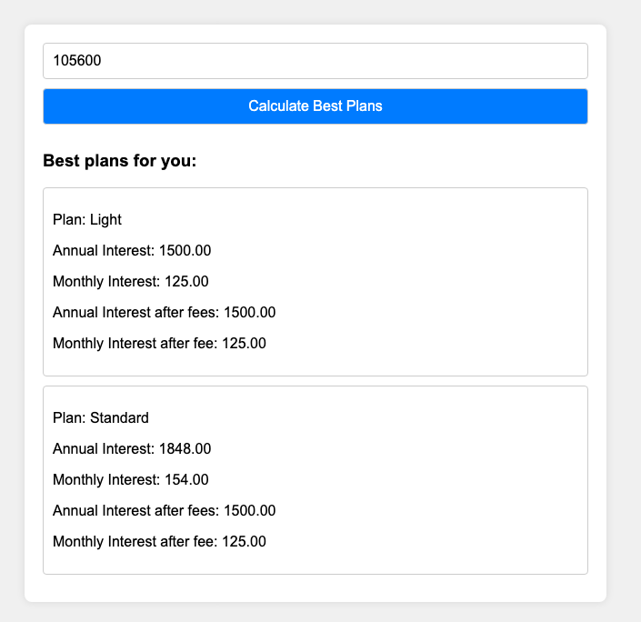

## Lunar Plan Advisor

*Currently only for Lunar Denmark*

This is a simple web application that helps you to choose the best Lunar plan based on
your savings. It is built with [Gin](https://gin-gonic.com/) and basic HTML/CSS/JavaScript.

## Reasoning

With Lunar paid plan, you receive positive interest on your accounts,regardless of the
amount you have.

Lunar provides
[interest rate calculator](https://www.lunar.app/en/personal/positive-interest-rate-lunar)
which can help you to visualize you what you can possibly earn with different amounts and
different plans. But it is lacking guidance for their users - it is not providing most
effective plan based on *your* savings. 

*Lunar Plan Advisor* helps you to determine a plan based on the ***net profit*** - interest
income after deducting plan fees.

This application guides you to select a savings plan based on net profit.
It helps identify the point at which one plan becomes more profitable than another by 
comparing the net profits of different plans.

For example, if you have 105600 DKK, you can choose between two plans because they yield
the same net profit. (Most likely) you would choose the second plan, because it will
offer better insurance coverage.

## Privacy
It is a client-side application, which means that your data is not stored or sent to
anyone.